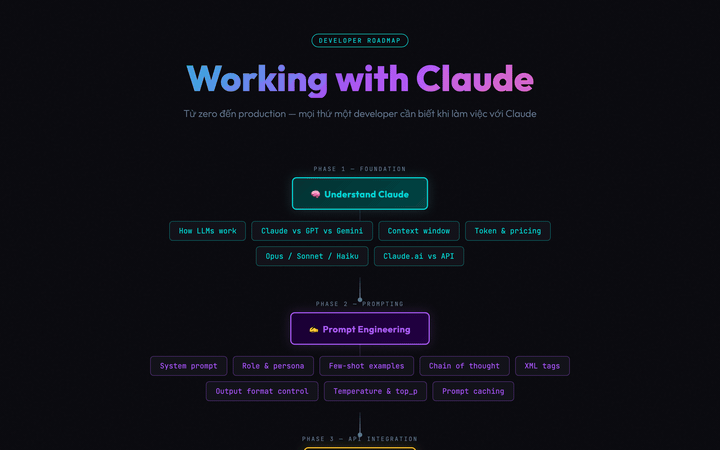

# Claude Dev Roadmap

> Lộ trình học Claude từ zero đến production — 7 phases, kèm working examples chạy được.
> Companion repo của [hueanmy.github.io/claude-roadmap.html](https://hueanmy.github.io/claude-roadmap.html).

<a href="https://hueanmy.github.io/claude-roadmap.html">
  
</a>

<p align="center"><sub>↑ Click the GIF to open the interactive roadmap. Every node links to the matching section here.</sub></p>

[Tiếng Việt](#tiếng-việt) · [English](#english)

---

## Tiếng Việt

Repo này là **journal học tập public** — mình tự build từng phase, ghi notes lại, để vừa học vừa share.

### 7 Phases

| # | Phase | Folder | Học gì |
|---|---|---|---|
| 1 | Foundation | [phase-1-foundation/](./phase-1-foundation/) | Claude là gì, model nào dùng cho gì, token & pricing, Claude.ai vs API |
| 2 | Prompting | [phase-2-prompting/](./phase-2-prompting/) | System prompt, XML tags, few-shot, chain of thought, prompt caching |
| 3 | API | [phase-3-api/](./phase-3-api/) | Messages API, streaming, vision, batch, rate limits |
| 4 | Tools & Agents | [phase-4-tools-agents/](./phase-4-tools-agents/) | Tool calling, agentic loop, computer use, web search |
| 5 | Claude Code | [phase-5-claude-code/](./phase-5-claude-code/) | CLAUDE.md, hooks, skills, subagents, slash commands |
| 6 | MCP | [phase-6-mcp/](./phase-6-mcp/) | MCP architecture, build server stdio, integrate Claude Code |
| 7 | Advanced | [phase-7-advanced/](./phase-7-advanced/) | Multi-agent, evals, cost optimization, observability |

### Cách dùng repo

**Setup 1 lần:**

```bash
# Cần Python 3.11+ và uv (https://docs.astral.sh/uv/)
git clone https://github.com/hueanmy/claude-roadmap.git
cd claude-roadmap
uv sync                              # cài deps
cp .env.example .env                 # rồi điền ANTHROPIC_API_KEY vào .env
```

**Chạy 1 example:**

```bash
uv run phase-1-foundation/examples/01-hello-claude.py
```

**Học theo flow:**

1. Đọc README của phase
2. Chạy example, đọc code + comments
3. Tự sửa code (đổi prompt, đổi model, thêm message) — break things, fix things
4. Ghi notes của bạn vào "Notes của tôi" trong README phase đó

### Ngôn ngữ

- **README phase** — Tiếng Việt (giải thích "tại sao")
- **Code comments** — English (universal)
- **Examples** — Python (Anthropic SDK chính chủ); Phase 6 thêm MCP server

### Repo này không phải

- ❌ Documentation chính thức của Anthropic — link gốc luôn ở [platform.claude.com](https://platform.claude.com/docs/)
- ❌ Production-ready boilerplate — examples tối giản để học, không hardened
- ❌ Khoá học có lộ trình ngày — học theo tốc độ riêng

---

## English

A public learning journal for Claude — 7 phases from API basics to production agents, with working code examples.

### Quick start

```bash
git clone https://github.com/hueanmy/claude-roadmap.git
cd claude-roadmap
uv sync
cp .env.example .env  # add ANTHROPIC_API_KEY
uv run phase-1-foundation/examples/01-hello-claude.py
```

Each phase has a README + `examples/` folder. Examples are minimal, idiomatic 2026-era Python (model IDs `claude-opus-4-7`, `claude-sonnet-4-6`, `claude-haiku-4-5`; adaptive thinking; effort parameter).

Phase READMEs are in Vietnamese (primary audience), code comments are in English.

---

## License

MIT. See [LICENSE](./LICENSE).

## Contributing

Repo này là journal cá nhân. PRs welcome cho: typo fix, code improvements, broken-link reports. Discussion về cách học → mở issue.
