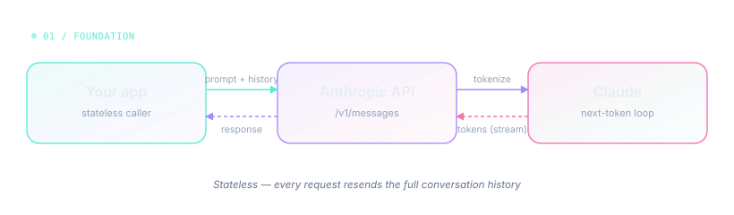
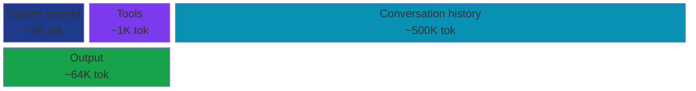
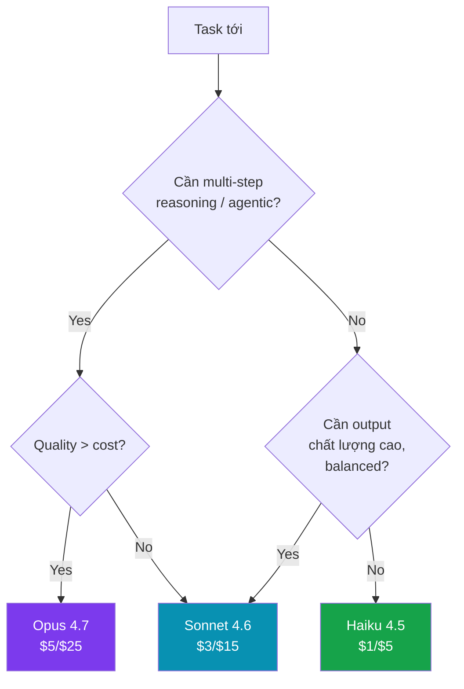

# Phase 1 — Foundation

> Hiểu Claude trước khi viết dòng code đầu tiên. Phase này không có code phức tạp, chỉ là mental model.

## Sub-topics

### - [ ] How LLMs work

Claude (và mọi LLM hiện đại) là **next-token predictor** — input một chuỗi token, output xác suất cho token tiếp theo, lặp lại cho tới khi gặp stop token. Không có "trí nhớ" ngầm giữa các API call: mỗi request là một function call stateless, bạn phải gửi lại toàn bộ lịch sử hội thoại mỗi lần.

**Tại sao matter:** Hiểu đến đây bạn mới biết vì sao streaming khả thi (token sinh ra từng cái một), vì sao prompt prefix matter cho caching (cache key = exact bytes of prefix), vì sao Claude "quên" turn trước nếu bạn không gửi lại.

**Học gì cụ thể:**
- Tokenization (sub-word units, BPE) — 1 từ tiếng Anh ≈ 1.3 token, tiếng Việt có dấu ≈ 2-3 token
- Autoregressive generation — tại sao output không thể "thấy trước" token sau
- Stateless API — implication cho session management

**Refs:** [Anthropic — How Claude works](https://www.anthropic.com/news) · example: [`phase-1-foundation/examples/01-hello-claude.py`](./examples/01-hello-claude.py)

---

### - [ ] Claude vs GPT vs Gemini

Cả 3 đều là LLM API thương mại nhưng triết lý khác nhau. Anthropic focus vào **safety + interpretability + agentic capabilities** (Constitutional AI, Tool use, Computer use, Claude Code). OpenAI rộng hơn (image gen, voice, embeddings). Google mạnh về multimodal native (Gemini xử lý audio/video tốt nhất hiện nay).

**Tại sao matter:** Bạn không cần religion war — biết khi nào pick model nào. Vd: code agent → Claude (Opus 4.7 dẫn đầu SWE-bench). Cheap classification → Gemini Flash. OpenAI Realtime API cho voice agent.

**Học gì cụ thể:**
- Khác biệt API contract (Anthropic dùng `messages`, OpenAI dùng `messages` nhưng schema khác, Gemini dùng `contents`)
- Pricing tiers (Anthropic 3 tiers, OpenAI có nano/mini/full, Gemini có Flash/Pro)
- Strengths thực tế (benchmark vs cảm nhận khi xài)

**Refs:** [SWE-bench leaderboard](https://www.swebench.com/) · [LMSYS arena](https://chat.lmsys.org/)

---

### - [ ] Context window

**Context window** = giới hạn tổng token (input + output) trong một request. Opus 4.7 / Sonnet 4.6: **1M tokens** (≈ 750K từ tiếng Anh, ≈ 5000 trang sách). Haiku 4.5: 200K. Khi vượt limit → 400 error `context_length_exceeded`.

**Tại sao matter:** Đây là constraint vật lý quan trọng nhất khi build agent. Conversation dài, codebase lớn, document load... đều phải tính token budget. Compaction, context editing, prompt caching — tất cả là kỹ thuật để xử lý context window.

**Học gì cụ thể:**
- Cách đếm token trước khi gửi: `client.messages.count_tokens(...)`
- Khi nào dùng compaction (server-side summarize) vs context editing (prune old turns)
- Vì sao **1M context không có nghĩa là dùng được hết** — cost scale với context, latency tăng, model performance degrade khi context quá dài (lost-in-the-middle)

**Refs:** [Context windows](https://platform.claude.com/docs/en/build-with-claude/context-windows) · [Compaction](https://platform.claude.com/docs/en/build-with-claude/compaction)

---

### - [ ] Token & pricing

Bill theo **input tokens + output tokens + cache** (cache rẻ hơn 90%, cache write đắt hơn 25%). Giá 2026:

| Model | Input ($/1M) | Output ($/1M) |
|---|---|---|
| Opus 4.7 / 4.6 | $5 | $25 |
| Sonnet 4.6 | $3 | $15 |
| Haiku 4.5 | $1 | $5 |

**Tại sao matter:** Một agentic loop với Opus có thể cost $5-50/run nếu không tối ưu. Hiểu pricing → biết khi nào route tới Haiku, khi nào dùng cache, khi nào dùng Batch API (50% off, async).

**Học gì cụ thể:**
- Output token đắt 5x input → minimize verbosity trong prompt design
- Cache read 0.1x giá thường, cache write 1.25x → break-even sau 2 reads
- Theo dõi `usage.input_tokens`, `usage.cache_read_input_tokens` mỗi response
- Tier rate limits scale theo spend tier (Tier 1 → Tier 4)

**Refs:** [Pricing](https://platform.claude.com/docs/en/pricing) · [Rate limits](https://platform.claude.com/docs/en/api/rate-limits)

---

### - [ ] Opus / Sonnet / Haiku — chọn model nào

Anthropic naming convention: **Opus** = mạnh nhất + đắt nhất, **Sonnet** = balanced (mặc định cho production), **Haiku** = nhanh + rẻ nhất. Không phải lúc nào Opus cũng tốt hơn — cho task đơn giản (classify, extract), Haiku output quality tương đương Opus mà rẻ 5-25 lần.

**Tại sao matter:** Đây là cost lever lớn nhất. Một app multi-step có thể có: classifier dùng Haiku, planner dùng Sonnet, code generator dùng Opus. Routing đúng = giảm cost 80% mà chất lượng không đổi.

**Học gì cụ thể:**
- Quyết định: task có cần multi-step reasoning, code, math, agentic? → Opus. Cần output dài chất lượng cao? → Sonnet. Classify, extract, format conversion? → Haiku.
- Effort parameter (`output_config.effort`): trên Opus có `low/medium/high/xhigh/max`, dial up/down theo cost-quality tradeoff
- Subagent pattern — main agent Opus, subagent Haiku để save context + cost (Claude Code làm thế)

**Refs:** [Models overview](https://platform.claude.com/docs/en/about-claude/models/overview) · [Effort parameter](https://platform.claude.com/docs/en/build-with-claude/effort)

---

### - [ ] Claude.ai vs API

**Claude.ai** = web/desktop app cho user cuối, có UI sẵn, có Projects, Artifacts, file upload, MCP plugins. Không cần code. **API** = endpoint `POST /v1/messages`, viết code gọi từ app của bạn. Không UI, không session storage tự động.

**Tại sao matter:** Đừng confuse 2 cái. Claude.ai dùng để consumer (cá nhân, daily driver). API dùng để build product (chatbot công ty, code agent, automation).

**Học gì cụ thể:**
- Khi nào dùng Claude.ai: research, draft, đọc tài liệu dài, một-off task
- Khi nào dùng API: scale, automation, integrate vào product, multi-user
- Pricing độc lập: Claude.ai có Pro/Team/Enterprise plan (subscription); API là pay-per-token
- Claude Code là CLI dùng API key của bạn — không phải Claude.ai
- Console (`console.anthropic.com`) là dashboard quản lý API keys + usage

**Refs:** [Console](https://console.anthropic.com/) · [Claude.ai](https://claude.ai)

---

## Examples

- [01-hello-claude.py](./examples/01-hello-claude.py) — gọi API Messages đầu tiên, in response + usage

## Notes của tôi

> Ghi notes khi học vào đây. Format gợi ý:
> - Học ngày: ___
> - Insight quan trọng nhất: ___
> - Còn confused: ___
> - Câu hỏi cần research thêm: ___
