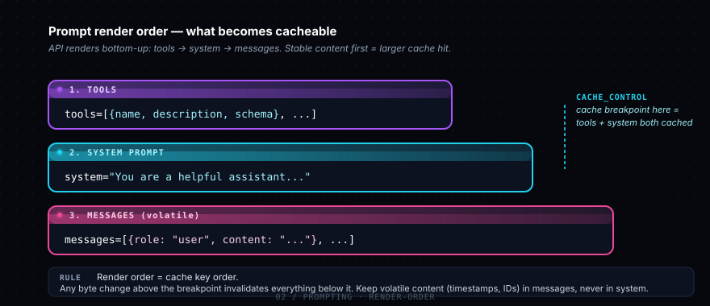
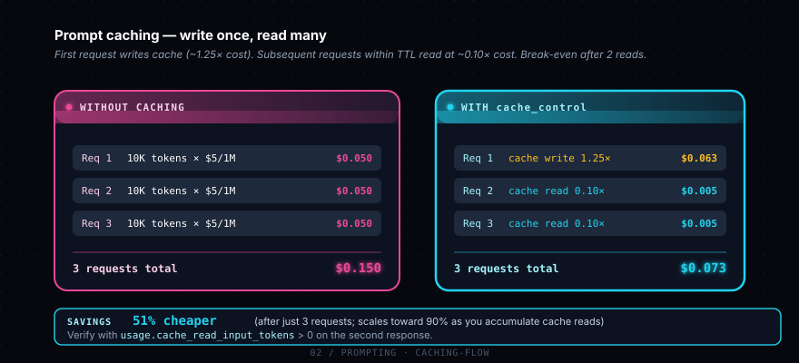

# Phase 2 — Prompting

> Cùng 1 model, prompt khác nhau → output khác hẳn. Đây là kỹ năng đòn bẩy nhất khi làm việc với LLM. Master prompting = tiết kiệm cost gấp 10 lần fine-tuning.

## Sub-topics

### - [ ] System prompt

System prompt là một field riêng (`system="..."` trong API call), khác với user message. Claude treat nó như "instructions của boss" — priority cao hơn user message thường, persistent across turns trong cùng conversation. Dùng để: set persona, define constraints, output format rules, behavior boundaries.

**Tại sao matter:** Một system prompt tốt loại bỏ 80% prompt engineering trong từng user message. Thay vì lặp "trả lời ngắn gọn, format markdown" mỗi turn, set 1 lần ở system prompt.

**Học gì cụ thể:**
- Khác biệt API: system là param riêng, không phải role trong messages array (như OpenAI cũ)
- System prompt không count vào "conversation" — model treat nó như standing instruction
- Length sweet spot: 200-2000 từ cho production app, có thể dài hơn nếu kèm reference docs
- Test bằng cách so sánh output có/không system prompt trên cùng input

**Refs:** [Defining roles with system prompts](https://platform.claude.com/docs/en/build-with-claude/prompt-engineering/system-prompts) · example: [`examples/01-system-prompt.py`](./examples/01-system-prompt.py)

---

### - [ ] Role & persona

Cho Claude một "danh tính" trong system prompt: *"You are a senior Python engineer with 15 years of experience..."* Có thể tăng quality output cho domain-specific task (code review, legal analysis, medical advice...).

**Tại sao matter:** Persona work, nhưng overrated. Đừng chỉ "you are an expert" rồi expect magic. Role chỉ helpful khi pair với **concrete behavioral instructions** ("answer in 3 bullet points max", "always cite sources", "refuse if X").

**Học gì cụ thể:**
- Pattern hiệu quả: `{role} + {expertise area} + {output style} + {constraints}`
- Anti-pattern: "you are the best AI" — vague claims không thay đổi behavior
- Khi nào persona work: domain với jargon riêng (tax, medicine, legal). Khi nào không: general task (summarize, translate)
- Test: A/B persona vs no persona trên 20 inputs, score blind

**Refs:** [System prompts](https://platform.claude.com/docs/en/build-with-claude/prompt-engineering/system-prompts)

---

### - [ ] Few-shot examples

**Show, don't tell.** Đưa 2-5 ví dụ input/output mẫu trong prompt, Claude pattern-match theo. Đặc biệt mạnh cho: classification, extraction, format conversion, style mimicry.

**Tại sao matter:** Few-shot thường beat zero-shot 20-40% accuracy cho structured task. Rẻ hơn fine-tuning vì chỉ tốn input token (cache được nếu fixed).

**Học gì cụ thể:**
- 3 ví dụ là sweet spot — ít hơn không đủ pattern, nhiều hơn ít gain
- Ví dụ phải **diverse** — cover edge cases bạn quan tâm
- Format: dùng XML tags `<example><input>...</input><output>...</output></example>` (xem topic kế)
- Cache few-shot prefix nếu nó stable — tiết kiệm 90% input cost

**Refs:** [Multishot prompting](https://platform.claude.com/docs/en/build-with-claude/prompt-engineering/multishot-prompting) · example: [`examples/02-xml-tags.py`](./examples/02-xml-tags.py)

---

### - [ ] Chain of thought (CoT)

Yêu cầu Claude "think step by step" trước khi đưa final answer → output chất lượng cao hơn cho task multi-step (math, logic, planning). Trên Opus 4.7 / Sonnet 4.6: dùng **adaptive thinking** (`thinking={"type": "adaptive"}`) — model tự quyết định khi nào cần think, không cần prompt CoT thủ công.

**Tại sao matter:** Thinking budget trade off latency vs quality. Adaptive thinking smart hơn manual "think step by step" prompt vì model tự tune depth.

**Học gì cụ thể:**
- Khác biệt: manual CoT (prompt-based) vs adaptive thinking (parameter-based)
- ⚠️ Opus 4.7 đã **bỏ** `budget_tokens` — chỉ còn adaptive
- `output_config.effort` levels: low / medium / high / xhigh / max — dial theo task complexity
- Thinking tokens cũng count vào output cost
- Khi nào tắt thinking: simple lookup, classification → set `thinking={"type": "disabled"}`

**Refs:** [Adaptive thinking](https://platform.claude.com/docs/en/build-with-claude/adaptive-thinking) · [Effort parameter](https://platform.claude.com/docs/en/build-with-claude/effort)

---

### - [ ] XML tags

Claude được train đặc biệt để recognize XML structure. Dùng `<context>`, `<task>`, `<example>`, `<rules>`, `<input>` tags để separate các phần của prompt → Claude không bị confuse khi prompt dài và mixed content.

**Tại sao matter:** Đây là Claude-specific best practice (GPT không sensitive với XML như Claude). Một prompt được tagged đúng cách có thể tăng accuracy 10-20% trên task phức tạp.

**Học gì cụ thể:**
- Common tags: `<context>`, `<task>`, `<example>`, `<input>`, `<output>`, `<rules>`, `<thinking>`
- Tag tự đặt cũng OK — không cần "official" list
- Combine với thinking: ask Claude to use `<thinking>` tags trước answer, easier to debug
- Đừng over-tag — prompt 500 chữ không cần 10 tags

**Refs:** [Use XML tags](https://platform.claude.com/docs/en/build-with-claude/prompt-engineering/use-xml-tags) · example: [`examples/02-xml-tags.py`](./examples/02-xml-tags.py)

---

### - [ ] Output format control

Bắt Claude output structured (JSON, YAML, CSV, custom format). Có 3 cách: (1) prompt instruction, (2) **Structured outputs** (`output_config.format` với JSON schema — recommend), (3) tool use với strict schema.

**Tại sao matter:** Output không structured = parse hell trong code của bạn. Structured outputs guarantee valid JSON match schema.

**Học gì cụ thể:**
- `client.messages.parse()` — SDK helper auto-validate response against schema
- `output_config.format` syntax (deprecated `output_format` param — đừng dùng)
- ⚠️ Opus 4.6+ đã **bỏ** assistant prefill (`{"role": "assistant", "content": "{"}`) — dùng structured outputs thay thế
- Limitations: không support recursive schema, không support `minLength`/`maxLength`
- First request slow (compile schema), sau đó cached 24h

**Refs:** [Structured outputs](https://platform.claude.com/docs/en/build-with-claude/structured-outputs)

---

### - [ ] Temperature & top_p (LEGACY)

⚠️ **Opus 4.7 đã bỏ hoàn toàn** sampling parameters — gửi `temperature`, `top_p`, `top_k` sẽ trả về 400 error. Cách Anthropic recommend control variance trên Opus 4.7: **prompting** ("Vary your phrasing across responses") hoặc **propose-N-options pattern** (xin model đề xuất 4 phương án trước khi build).

**Tại sao matter:** Nếu code của bạn là legacy có `temperature=0.7`, migration to Opus 4.7 sẽ break. Hiểu để rebuild logic mà không cần sampling param.

**Học gì cụ thể:**
- Còn work trên: Sonnet 4.6, Haiku 4.5, các model 4.5 trở về trước
- Trên Opus 4.7 thay thế: `effort: "low"` cho determinism, prompt-based variance
- Để có "output đa dạng" qua nhiều run: ask model propose 4 directions, user chọn 1
- `temperature=0` chưa bao giờ guarantee identical output (sampling vẫn có jitter)

**Refs:** [Migration guide → Opus 4.7](https://platform.claude.com/docs/en/about-claude/models/migration-guide#migrating-to-opus-4-7)

---

### - [ ] Prompt caching

Cache prefix của prompt (system + tools + early messages) → request sau đọc cache, **rẻ 90%, nhanh 85%**. Cache key = exact bytes of prefix; thay đổi 1 ký tự ở đầu = invalidate toàn bộ.

**Tại sao matter:** Đây là **single biggest cost optimization** cho production app. Chatbot với 10K-token system prompt: không cache trả $50/1000 calls, có cache trả $5. Claude Code dùng caching aggressive → đó là vì sao bạn không bị bill bão khi mỗi turn nó đọc lại codebase.

**Học gì cụ thể:**
- `cache_control: {"type": "ephemeral"}` — TTL 5 phút (default), hoặc `"ttl": "1h"` (đắt hơn)
- Min cacheable prefix: Opus/Haiku = 4096 tokens, Sonnet 4.6 = 2048 tokens
- Max 4 breakpoints / request
- Render order: `tools` → `system` → `messages`. Đặt cache breakpoint ở cuối `system` cache cả tools + system
- Verify: check `usage.cache_read_input_tokens` > 0 trên request thứ 2
- Silent invalidators: `datetime.now()` trong system prompt, JSON unsorted, tool list khác giữa requests

**Refs:** [Prompt caching](https://platform.claude.com/docs/en/build-with-claude/prompt-caching) · example: [`examples/03-prompt-caching.py`](./examples/03-prompt-caching.py)

---

## Examples

- [01-system-prompt.py](./examples/01-system-prompt.py) — vai trò của system prompt (so sánh có/không)
- [02-xml-tags.py](./examples/02-xml-tags.py) — structure prompt phức tạp bằng XML tags
- [03-prompt-caching.py](./examples/03-prompt-caching.py) — cache 1 document dài, query nhiều lần

## Notes của tôi

> ___
