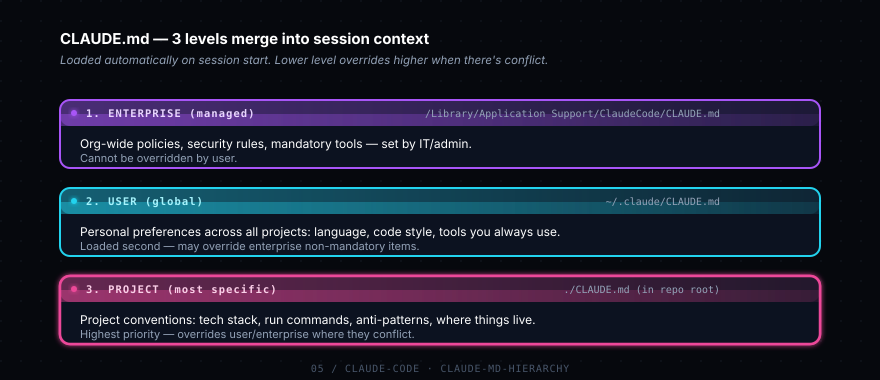
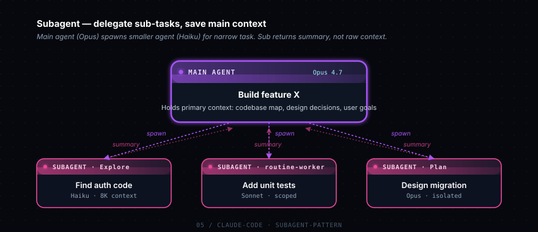
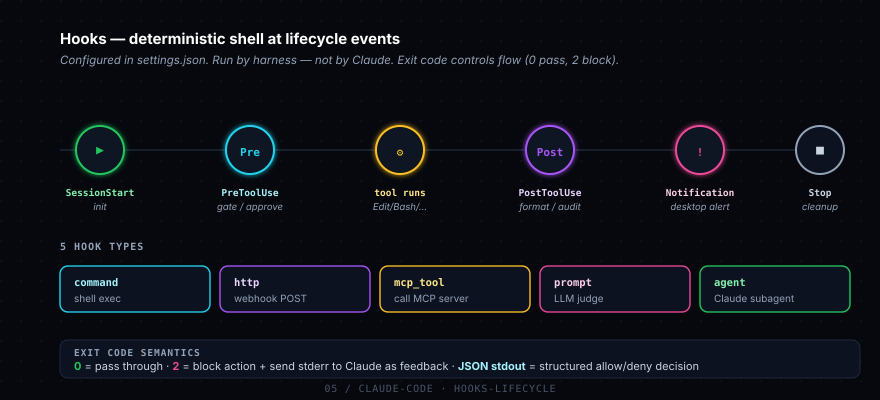

# Phase 5 — Claude Code

> Claude Code = Anthropic CLI chính chủ để code. Đây là productivity multiplier khác hẳn web Claude.ai — agentic, có quyền đọc/sửa file, chạy bash, gọi MCP servers, tự lên plan rồi execute. Phase này quan trọng nhất nếu bạn là dev.

## Cài đặt

```bash
npm install -g @anthropic-ai/claude-code
claude  # khởi động trong project bất kỳ
```

## Sub-topics — Concepts

### - [ ] CLAUDE.md (memory file)



File markdown ở root project (hoặc `~/.claude/CLAUDE.md` cho global). Auto-load mỗi session start. Define convention dự án: tech stack, code style, commands hay dùng, rules, anti-patterns.

**Tại sao matter:** Không có CLAUDE.md = mỗi session bạn phải nhắc lại "dùng pytest, không dùng print, type hints required...". Có CLAUDE.md = Claude vào việc luôn, theo đúng convention.

**Học gì cụ thể:**
- 3 levels: project (`./CLAUDE.md`), user (`~/.claude/CLAUDE.md`), enterprise (managed)
- Sections nên có: project overview, tech stack, conventions, common commands, things-to-NOT-do
- Length sweet spot: 100-500 lines. Quá ngắn vô nghĩa, quá dài tốn context budget mỗi turn
- Imperative form: "Use `uv run pytest`" thay vì "we typically use pytest"
- Reference files: link tới `architecture.md`, `glossary.md` thay vì copy nội dung

**Refs:** [Memory](https://docs.claude.com/en/docs/claude-code/memory) · template: [`examples/CLAUDE.md.example`](./examples/CLAUDE.md.example)

---

### - [ ] Skills

Folder structure: `~/.claude/skills/<name>/SKILL.md` (hoặc project-level `.claude/skills/`). Mỗi skill là một "expert mode" — Claude load **on-demand** khi user task match skill description.

**Tại sao matter:** Khác CLAUDE.md (luôn load), Skills load có chọn lọc → không tốn context mặc định. Cho domain-specific workflow: PR review, security audit, migration script, etc.

**Học gì cụ thể:**
- Frontmatter format: `name`, `description` (Claude đọc cái này để quyết load)
- Body: instruction + procedure cụ thể (step 1, step 2...)
- Description quality = load accuracy. Bad: "code review skill". Good: "Use when user asks to review a PR, audit changes, or critique code quality before merge."
- Skills có thể call subagent, dùng tools, đọc file — như mini-agent có scope hẹp
- Discoverability: skill chỉ load nếu task description match — viết description theo perspective user

**Refs:** [Skills](https://docs.claude.com/en/docs/claude-code/skills) · template: [`examples/skill-example/SKILL.md`](./examples/skill-example/SKILL.md)

---

### - [ ] Subagents



Spawn Claude khác (thường Haiku — rẻ hơn) cho subtask, save context của main agent. Pattern: main agent spawn subagent với task hẹp, subagent return kết quả, main agent tổng hợp.

**Tại sao matter:** Main agent context có hạn. Search codebase, đọc 10 files, tổng hợp → tốn 50K tokens trong main context. Spawn subagent: sub đọc files, return summary 2K tokens → main giữ context cho task chính.

**Học gì cụ thể:**
- Khi nào dùng: search/explore (subagent_type=Explore), routine task (routine-worker), parallel research
- Mỗi subagent là instance độc lập — không thấy conversation history của main
- Phải brief subagent đầy đủ trong prompt vì nó vào "lạnh"
- Subagent có thể dùng tools, nhưng không edit file (mặc định read-only) trừ khi explicit
- Cost: subagent count separate vào bill, nhưng usually rẻ hơn vì model nhẹ hơn

**Refs:** [Sub-agents](https://docs.claude.com/en/docs/claude-code/sub-agents)

---

### - [ ] Hooks



Shell commands chạy tại lifecycle events (PreToolUse, PostToolUse, Stop, FileChanged...). Định nghĩa trong `settings.json`. **Deterministic** — không phụ thuộc Claude quyết định, harness của Claude Code chạy luôn.

**Tại sao matter:** Tự động hóa formatting, audit log, file protection, desktop notification — những việc bạn muốn ALWAYS happen, không trust Claude phải nhớ.

**Học gì cụ thể:**
- Events: `PreToolUse`, `PostToolUse`, `Notification`, `SessionStart`, `Stop`, `PreCompact`, `FileChanged`
- 5 hook types: `command` (shell), `http` (webhook), `mcp_tool`, `prompt` (LLM judge), `agent`
- Matcher để filter (vd `matcher: "Edit|Write"` chỉ match khi Claude edit file)
- Exit code semantic: `0` = pass, `2` = block + send stderr về Claude, JSON stdout = structured decision
- Vars available: `$TOOL_INPUT_FILE_PATH`, `$TOOL_NAME`, etc.

**Refs:** [Hooks](https://docs.claude.com/en/docs/claude-code/hooks) · example: [`examples/hooks-example/settings.json`](./examples/hooks-example/settings.json)

---

### - [ ] MCP integration

Connect external tools/data via Model Context Protocol. Claude Code có MCP support built-in qua `.mcp.json` (project) hoặc `~/.claude.json` (user). Tools từ MCP servers xuất hiện trong tool list của Claude tự nhiên.

**Tại sao matter:** Mở rộng capability của Claude Code mà không cần mod core. Ví dụ: connect MCP server cho Linear → Claude có thể đọc/tạo Linear issue trong terminal. Connect Atlassian → đọc Jira/Confluence.

**Học gì cụ thể:**
- Config schema: `{"mcpServers": {"<name>": {"command": "...", "args": [...], "env": {...}}}}`
- Slash command `/mcp` để debug — list servers connected, errors, tools available
- Stdio transport (local subprocess) vs SSE/HTTP (remote)
- Phase 6 đi sâu hơn vào MCP

**Refs:** [MCP](https://docs.claude.com/en/docs/claude-code/mcp) · Phase 6 examples

---

### - [ ] Slash commands

Custom commands tự define ở `~/.claude/commands/<name>.md`. Khi gõ `/<name>`, Claude execute prompt trong file đó. Như macro cho prompt thường dùng.

**Tại sao matter:** Thay vì gõ "review changed code, focus on bugs and security" mỗi lần → tạo `/review` chạy 1 phát.

**Học gì cụ thể:**
- File location: `~/.claude/commands/<name>.md` (user) hoặc `.claude/commands/<name>.md` (project)
- Body của file = prompt đầy đủ Claude sẽ execute
- Có thể accept args: dùng `$ARGUMENTS` placeholder
- Examples ích lợi: `/init`, `/review`, `/security-review`, `/schedule`, `/loop`
- Skills vs commands: commands = explicit user trigger (bạn gõ `/x`), skills = auto-load by relevance

**Refs:** [Slash commands](https://docs.claude.com/en/docs/claude-code/slash-commands)

---

### - [ ] Permission modes

Control mức độ autonomy của Claude Code. Default: hỏi mỗi tool có side effect. Modes: `accept-edits` (auto-accept Edit/Write), `plan` (read-only, lập kế hoạch), `bypass-permissions` (yolo, dangerous).

**Tại sao matter:** Trade-off: an toàn (default, hỏi mỗi cái) vs flow (accept-edits, đỡ cần Enter mỗi action). Plan mode để Claude analyze codebase nhưng không modify gì.

**Học gì cụ thể:**
- `Shift+Tab` toggle giữa modes (default → accept-edits → plan → default)
- `bypass-permissions` chỉ dùng trong sandbox/CI — production code đừng
- `--permission-mode` flag khi launch: `claude --permission-mode plan`
- Settings file: `permissionMode` field cho default per-project
- Hooks có thể override permission decision

**Refs:** [Permission modes](https://docs.claude.com/en/docs/claude-code/permissions)

---

### - [ ] Plan mode

Đặc biệt: read-only, Claude chỉ có thể phân tích + đề xuất plan, không được Edit/Write/Bash. Output cuối là markdown plan để bạn review trước khi switch sang mode khác để execute.

**Tại sao matter:** Cho task lớn ("refactor auth module", "add new feature X"), planning là 50% của việc. Plan mode tách bạch giai đoạn "think" và "execute" → ít sai, dễ review.

**Học gì cụ thể:**
- Trigger: `Shift+Tab` (cycle modes) hoặc `claude --permission-mode plan`
- Workflow: vào plan mode → "design X feature" → review plan → exit mode → execute
- Plan có thể save thành file (`.claude/plans/feature-x.md`) để track + iterate
- Khi nào skip plan mode: bug fix nhỏ, single-file change, exploratory task

**Refs:** [Plan mode](https://docs.claude.com/en/docs/claude-code/permissions#plan-mode)

---

### - [ ] Headless mode

`claude -p "prompt"` chạy non-interactive — Claude execute task rồi exit. Cho automation: CI scripts, cron jobs, git hooks.

**Tại sao matter:** Mở khóa Claude Code làm tool trong pipeline. Vd: `claude -p "review the diff and post comment"` chạy trong GitHub Action → auto code review.

**Học gì cụ thể:**
- Output mode: `--output-format json` cho machine parsing, default text cho human
- Combine với `gh`, `jq`, shell scripting → Claude trở thành component trong pipeline
- Permission mode `bypass-permissions` thường cần cho headless (không có user confirm)
- Cost concern: headless run trên CI có thể ăn $$$ nếu trigger nhiều — set spend limit ở Console
- Use case: auto PR review, auto issue triage, scheduled cleanup, CI test fix

**Refs:** [Headless mode](https://docs.claude.com/en/docs/claude-code/cli-reference)

---

### - [ ] Git worktrees

Chạy nhiều Claude instances song song trên branches khác nhau, không conflict working dir. `git worktree add ../proj-feature-x feature-x` → có 2 working dir, 2 Claude session độc lập.

**Tại sao matter:** Pattern "agent fan-out" — 1 main task fork ra 3 parallel attempts (mỗi cái 1 worktree), bạn pick cái tốt nhất. Hoặc 1 Claude làm feature, 1 Claude khác fix bug.

**Học gì cụ thể:**
- `git worktree list` để xem worktrees hiện có
- `git worktree remove <path>` cleanup khi xong
- Skill `Agent` của Claude Code có `isolation: "worktree"` mode — auto-create worktree cho subagent
- Useful khi: parallel exploration, isolating risky changes, demo branches

**Refs:** [Git worktrees](https://git-scm.com/docs/git-worktree)

---

## Sub-topics — Slash Commands phổ biến

| Command | Mục đích |
|---|---|
| `/help` | List lệnh + keyboard shortcuts |
| `/plan` | Vào plan mode (read-only) |
| `/clear` | Clear context window về 0 |
| `/compact` | Nén context khi gần đầy (giữ summary) |
| `/memory` | Xem/edit CLAUDE.md đang load |
| `/cost` | Xem token usage + $ session hiện tại |
| `/doctor` | Chẩn đoán issues (config, MCP, network) |
| `/init` | Init CLAUDE.md mới cho repo |
| `/review` | Review pending changes |
| `/security-review` | Security review pending changes |
| `/mcp` | Debug MCP server connections |
| `/schedule` | Schedule background agent (recurring task) |
| `/loop` | Run command on interval |

---

## Sub-topics — Keyboard shortcuts

| Shortcut | Hành động |
|---|---|
| `Ctrl+C` | Cancel current operation |
| `Ctrl+R` | Reverse-search prompt history |
| `Shift+Tab` | Cycle permission modes (default → accept-edits → plan) |
| `Esc + Esc` | Interrupt + clear input box |
| `@<file>` | Mention file (auto-include trong context) |
| `\` (cuối dòng) | Multiline input |
| `↑` / `↓` | Navigate prompt history |

---

## Examples

- [CLAUDE.md.example](./examples/CLAUDE.md.example) — template CLAUDE.md cho dự án Python
- [hooks-example/settings.json](./examples/hooks-example/settings.json) — hook chạy `ruff format` sau khi Claude edit Python
- [skill-example/SKILL.md](./examples/skill-example/SKILL.md) — skill PR description writer

## Tài liệu chính chủ

- [Claude Code overview](https://docs.claude.com/en/docs/claude-code/overview)
- [CLAUDE.md / memory](https://docs.claude.com/en/docs/claude-code/memory)
- [Hooks](https://docs.claude.com/en/docs/claude-code/hooks)
- [Skills](https://docs.claude.com/en/docs/claude-code/skills)
- [MCP](https://docs.claude.com/en/docs/claude-code/mcp)

## Notes của tôi

> ___
