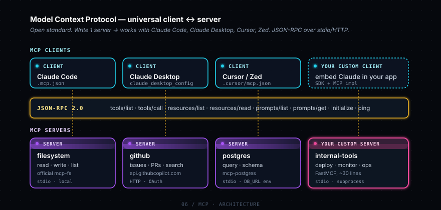
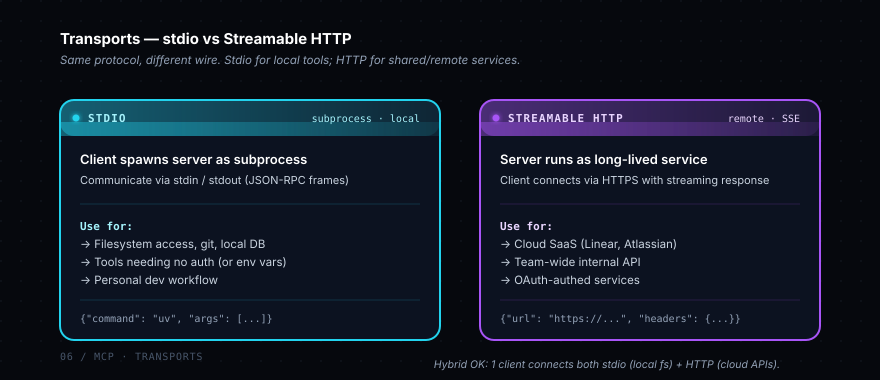

# Phase 6 — Model Context Protocol (MCP)

> MCP = giao thức chuẩn open source để LLM (Claude, GPT, Gemini...) kết nối với tools / data sources external. Anthropic publish 2024-11. Đây là thành tựu lớn — trước MCP, mỗi LLM client phải tích hợp riêng từng tool. Sau MCP, viết 1 server xài được everywhere.

## Sub-topics

### - [ ] MCP architecture



Pattern client-server: **MCP client** (Claude Code, Claude Desktop, Cursor, Zed...) ↔ **MCP server** (database, GitHub, Linear, Postgres...). Communicate qua JSON-RPC. Server expose 3 primitives: **Tools** (function callable), **Resources** (data readable), **Prompts** (template).

**Tại sao matter:** Hiểu architecture giúp bạn debug khi MCP not working — biết check phía nào (client config? server crash? schema mismatch?). Cũng giúp bạn quyết định khi nào build server mới vs dùng cái có sẵn.

**Học gì cụ thể:**
- 3 primitives: Tools (gọi như function), Resources (read như file), Prompts (template user trigger)
- Transport layer: stdio (subprocess) hoặc Streamable HTTP (remote)
- Capability negotiation: client + server announce features support khi handshake
- Session lifecycle: client spawn server → handshake → request/response → cleanup

**Refs:** [MCP introduction](https://modelcontextprotocol.io/introduction) · [Architecture](https://modelcontextprotocol.io/docs/concepts/architecture)

---

### - [ ] MCP servers

Process expose tools/resources/prompts qua JSON-RPC. SDK chính chủ cho Python (`mcp`), TypeScript (`@modelcontextprotocol/sdk`), Go, Java, C#, Kotlin.

**Tại sao matter:** Build server riêng cho domain của bạn → mọi LLM client tự động xài được. Vd: build `internal-db-mcp` → dev team xài Claude Code, designer xài Cursor, PM xài Claude Desktop, đều query được internal DB.

**Học gì cụ thể:**
- FastMCP (Python) — decorator-based, đơn giản nhất. `@mcp.tool()`, `@mcp.resource()`, `@mcp.prompt()`
- Tool definition auto từ Python type hints + docstring
- Pre-built servers list: filesystem, github, postgres, slack, gmail, sentry, time, fetch, memory...
- Run as subprocess: `uv run python server.py` — server đọc stdin, write stdout (JSON-RPC frames)

**Refs:** [Python SDK](https://github.com/modelcontextprotocol/python-sdk) · [Server quickstart](https://modelcontextprotocol.io/quickstart/server) · example: [`examples/01-stdio-mcp-server/`](./examples/01-stdio-mcp-server/)

---

### - [ ] MCP clients

Apps gọi MCP server. Phổ biến nhất: Claude Code, Claude Desktop, Cursor, Zed, Continue.dev. Bạn thường KHÔNG cần viết client — pick một cái có sẵn.

**Tại sao matter:** Pick client đúng cho use case: terminal-first (Claude Code), GUI chat (Claude Desktop), in-editor (Cursor/Zed), embedded (Continue trong VS Code).

**Học gì cụ thể:**
- Mỗi client có config file riêng:
  - Claude Code: `.mcp.json` (project) hoặc `~/.claude.json` (user)
  - Claude Desktop: `~/Library/Application Support/Claude/claude_desktop_config.json` (mac)
  - Cursor: `.cursor/mcp.json`
- Common config schema: `{"mcpServers": {"name": {"command": "...", "args": [...], "env": {}}}}`
- Build custom client khi muốn: embed Claude trong app riêng, control UI hoàn toàn

**Refs:** [Available clients](https://modelcontextprotocol.io/clients)

---

### - [ ] Build custom MCP server

Steps: (1) `uv add mcp`, (2) define tools/resources với decorator, (3) `mcp.run()`, (4) wire vào client config.

**Tại sao matter:** Internal tools team bạn dùng nhiều — DB queries, deployment scripts, monitoring queries, internal API — wrap vào MCP server, mọi người xài Claude Code đều access được.

**Học gì cụ thể:**
- Type hints quan trọng — FastMCP generate JSON Schema từ đó
- Docstring là tool description Claude đọc — viết clear "khi nào dùng tool này"
- Error handling: throw exception → MCP framework convert thành error response
- Testing: `mcp dev server.py` — interactive client để test trước khi wire vào Claude
- Versioning: server có thể return capabilities, client check trước khi gọi

**Refs:** [Build a server](https://modelcontextprotocol.io/quickstart/server) · example: [`examples/01-stdio-mcp-server/server.py`](./examples/01-stdio-mcp-server/server.py)

---

### - [ ] MCP + Claude Code

Claude Code support MCP built-in. Add server vào `.mcp.json` → restart Claude → tools available trong tool list. Slash command `/mcp` để debug.

**Tại sao matter:** Tăng capability của Claude Code mà không cần fork hay mod. Vd: connect MCP server cho Linear → Claude đọc/tạo Linear issue trong terminal. Connect Atlassian → đọc Jira/Confluence inline khi code.

**Học gì cụ thể:**
- `.mcp.json` schema: `{"mcpServers": {"<name>": {"command": "...", "args": [...]}}}`
- `/mcp` command: list servers, status (connected/error), tools count
- Per-project config (`.mcp.json` ở repo) vs global (`~/.claude.json`)
- Approve flow: lần đầu gọi tool MCP, Claude Code hỏi "approve this server?" — once
- Common gotcha: server crash → tools không xuất hiện. Check `/mcp` errors

**Refs:** [MCP in Claude Code](https://docs.claude.com/en/docs/claude-code/mcp)

---

### - [ ] Stdio vs Streamable HTTP transport



**Stdio** (subprocess): client spawn server local, communicate qua stdin/stdout. **Streamable HTTP** (remote): server chạy sẵn ở URL, client connect qua HTTPS với streaming response.

**Tại sao matter:** Quyết định kiến trúc:
- Stdio cho: local tools (filesystem, git, local DB) — không cần network, no auth needed
- HTTP cho: shared services (team-wide internal API, third-party SaaS), need auth (OAuth)

**Học gì cụ thể:**
- Stdio config: `{"command": "uvx", "args": ["mcp-server-foo"]}`
- HTTP config: `{"url": "https://...", "headers": {"Authorization": "Bearer ..."}}`
- HTTP server cần handle: SSE response, auth (OAuth 2.1), CORS
- Stdio limitation: 1 client / instance (subprocess không share). HTTP: nhiều clients
- Hybrid setup OK: 1 client connect cả stdio (local fs) + HTTP (Linear cloud)

**Refs:** [Transports](https://modelcontextprotocol.io/docs/concepts/transports)

---

### - [ ] Auth & security

Stdio servers thường dùng env var (`GITHUB_TOKEN`, `DB_URL`) — pass qua client config. HTTP servers dùng OAuth 2.1 (PKCE flow) hoặc bearer token. Anthropic Managed Agents có Vaults — store credential, auto-refresh OAuth.

**Tại sao matter:** MCP server có quyền access data của bạn — cần security đúng. Wrong setup → leak credential, expose internal API public.

**Học gì cụ thể:**
- Env var pass qua config: `{"env": {"GITHUB_TOKEN": "${GITHUB_TOKEN}"}}` (interpolate từ shell env)
- Đừng commit credential vào `.mcp.json` — dùng env var hoặc 1Password CLI
- HTTP server: implement OAuth 2.1 với PKCE — không dùng bearer token plaintext
- Sandboxing: server chạy local có quyền full filesystem — chỉ run servers từ source bạn trust
- Tool result có thể chứa data nhạy cảm → check trước khi log

**Refs:** [Authorization](https://modelcontextprotocol.io/specification/2025-03-26/basic/authorization)

---

## Setup

```bash
# Install MCP deps (optional group)
uv sync --group mcp

# Run example server standalone (will hang waiting for JSON-RPC stdin — bình thường):
uv run --group mcp python phase-6-mcp/examples/01-stdio-mcp-server/server.py
```

## Wire vào Claude Code

Tạo `.mcp.json` ở root repo:

```json
{
  "mcpServers": {
    "time-demo": {
      "command": "uv",
      "args": [
        "run", "--group", "mcp",
        "python",
        "phase-6-mcp/examples/01-stdio-mcp-server/server.py"
      ]
    }
  }
}
```

Restart Claude Code → `/mcp` → thấy `time-demo` connected → ask "what time is it?"

## Examples

- [01-stdio-mcp-server/](./examples/01-stdio-mcp-server/) — MCP server siêu nhỏ với 1 tool (`get_time`)

## Tài liệu chính chủ

- [MCP introduction](https://modelcontextprotocol.io/introduction)
- [Build a server](https://modelcontextprotocol.io/quickstart/server)
- [MCP in Claude Code](https://docs.claude.com/en/docs/claude-code/mcp)
- [Available servers](https://github.com/modelcontextprotocol/servers)

## Notes của tôi

> ___
